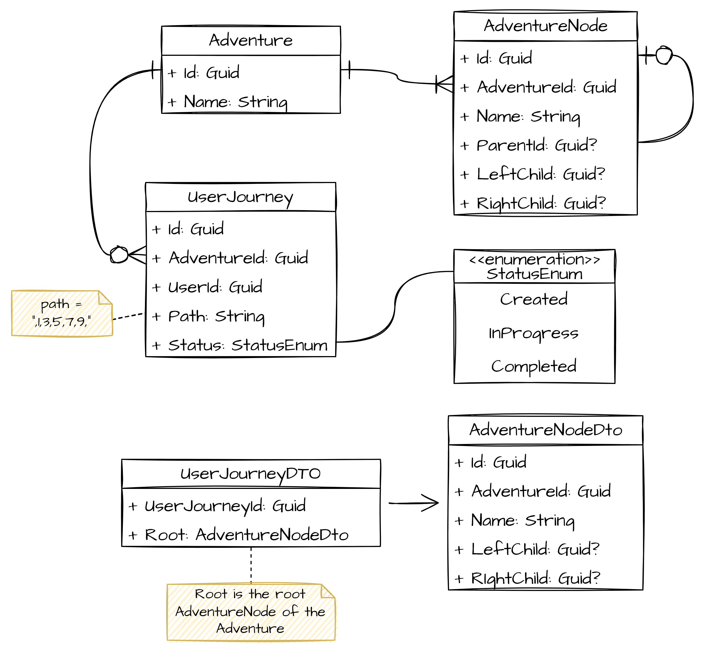
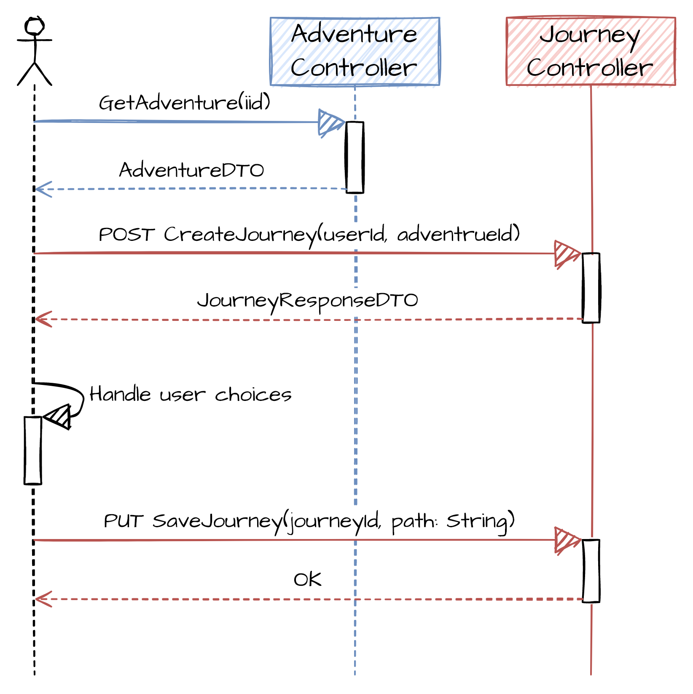
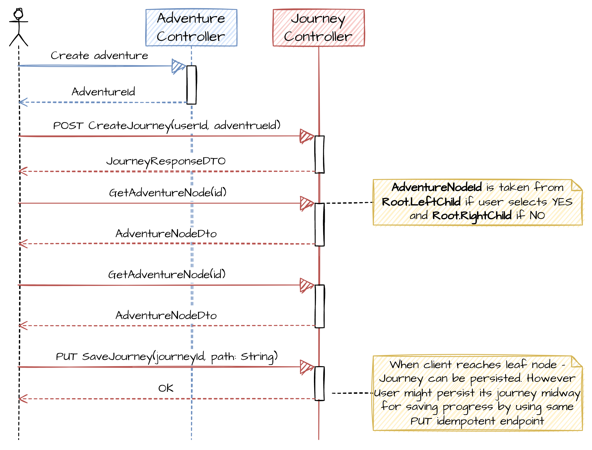
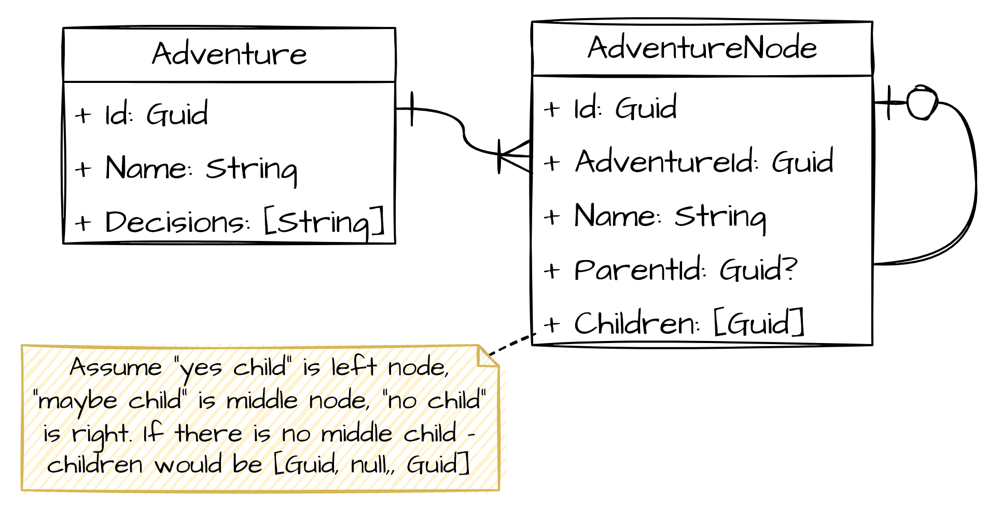
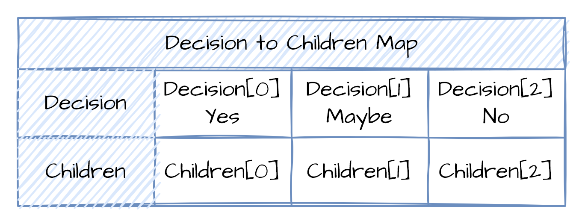
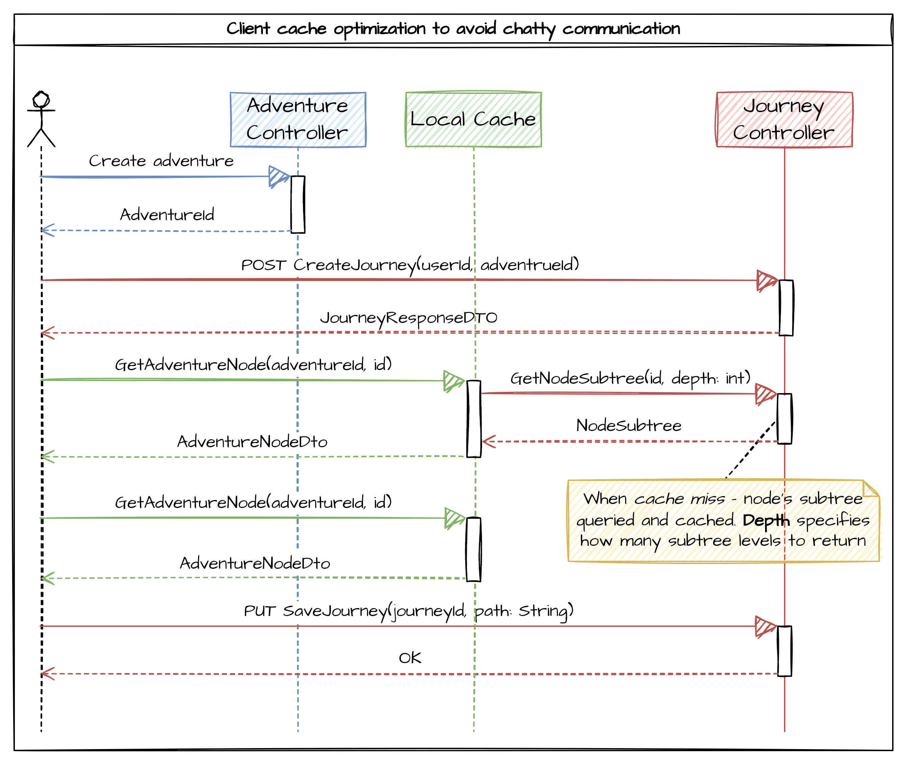

# Lobster Adventures Test Assignment

## Design assumptions
1. Left subtree is considered to be Yes subtree. Right subtree is considered to be No subtree.
2. For simplicity sake, system supports only binary decision tree with YES and NO decision.
3. Storing tree in serialized BFS, DFS manner is not an option as we need a way to work with a big trees, efficently querying subtrees or getting right or left children of specific node without tree deserialization.
4. API is imlemented to support full tree retrieval by client in case of small tree. For huge trees retrieval of whole tree by the client would cause high latencies, additinalty due to the nature of domain,  each choice eliminates half of the tree, which makes huge tree retrieval by client is not beneficial. Client can implement hybrid approach by making `HEAD` request of `GET adventure/tree/id`and fetch full subtree if `ContentLength` is small and go for node by node approach when tree is huge.

## Binary Decision Tree representation

## Domain Class Diagram

# Client to API communication sequence diagrams
API supports 2 types of client to API communication:
1. Complete tree retrieval
2. Node by node retrieval

## Complete tree retrieval
Retrieval of complete adventure tree, caching it on the client side, handling user choices on the client, persisting its state to the database. This approach is recommended when tree is not huge and nodes are lightweight.

## Node by node retrieval
Retrieving tree adventure nodes by node, rendering on the client, persisting choice in the database. 
This approach is recommended when decision tree is huge (either huge number of nodes or huge size of the node itself) and transferring it to the client would not be considered beneficial. Request on each user choice might look like overhead, but after doing some calculations - it starts looking reasonable. 

Let’s assume we have a tree of 1 000 000 nodes. Tree of this size has 20 levels (`log2(1000000) = ~20`). In this case user would have to do 20 request to the server. Taking into account that these requests would be stateless with small payload - it makes it a great candidate for reverse proxy caching.

Additionally this can be optimized even further by retrieving node’s subtrees in chunks, say 3 levels, which is a good compromise between number of requests and payload. More on this in Improvements section of this document.

# Possible improvements
## Non binary nature of decision tree
In case Decision Tree should have more options or name decision differently than YES or NO, next schema could be used:

Described above design works only for N-ary tree, with the standard Decisions list.

In case decisions names vary from node to node, or tree transforms to a graph - adjacency list can be used to persist its state.

## Partial tree retrieval and cache
In case of tradeoffs between load and bandwitdh, to avoid chatty communication it is possible to optimize by caching nodes subtree on the client side or cache server and access `JourneyController` only when node is not in the cache.

In order to facilitate quick queries of node’s subtree, [Modified Preorder Traversal](https://gist.github.com/tmilos/f2f999b5839e2d42d751) approach can be used.

By applying this approach, `AdventureNode` would be extended with 2 more fields, `rightIndex` and `leftIndex`, which are used for fast `SELECT`s of node’s subtree.